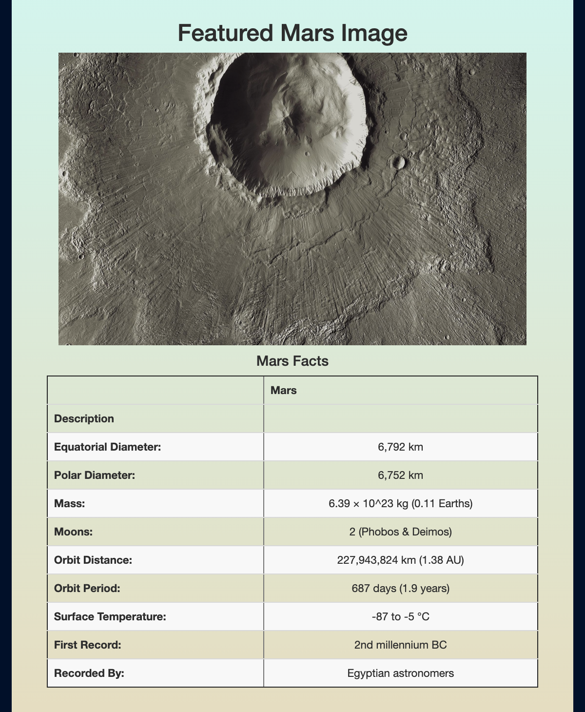
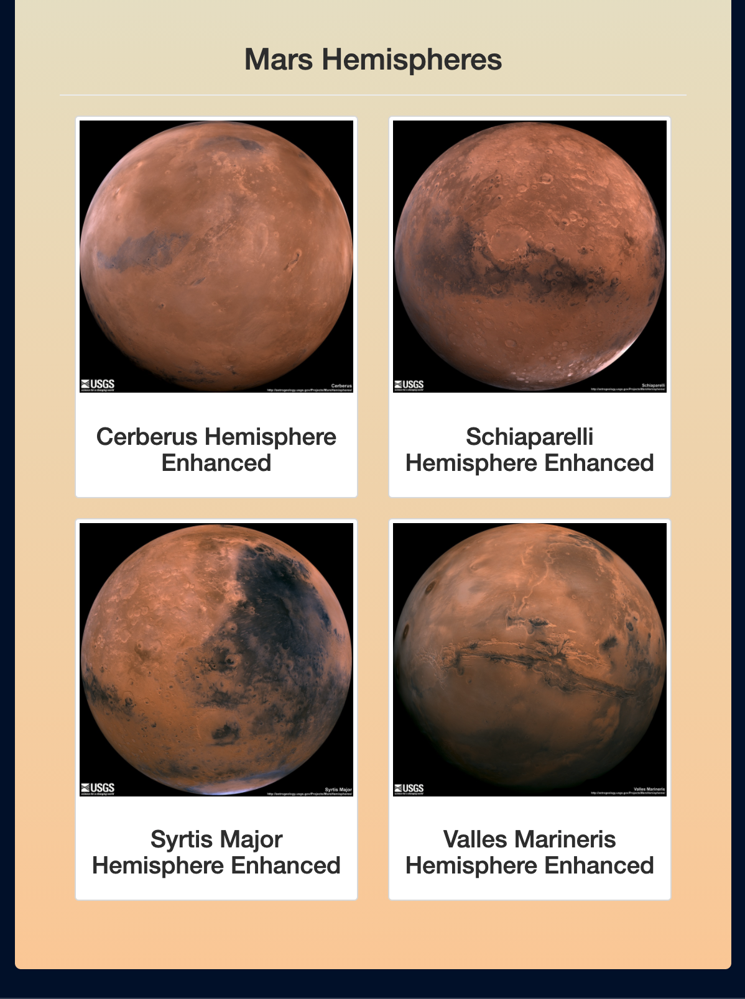

# Mission-to-Mars
Web scraping to gather information about NASA's Mission to Mars. 

## Overview
The goal of this project is to write a script that can gather information about NASA's Mission to Mars from their website and compile that data into a Flask app for visualization. The app contains a button that can automatically update Mars data on the Flask app when clicked. 

## Tools
* Chrome Developer
* Beautiful Soup
* Splinter
* MongoDB
* Flask

### Scraped Web Results

### Mars Facts

### Mars Hemisphere Images
